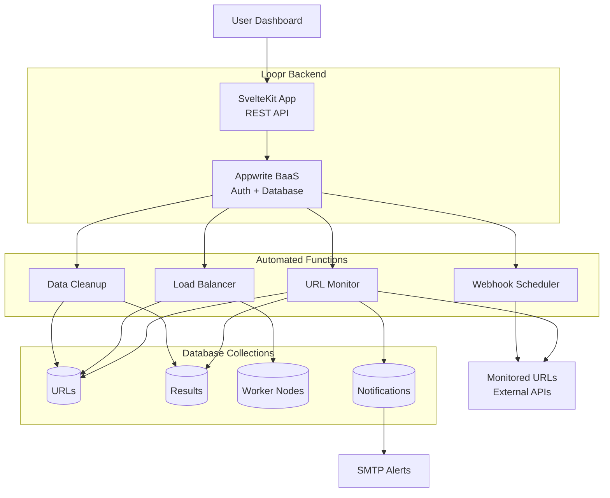

<p align="center"></p>
<h1 align="center"><b>Loopr</b></h1>
<h4 align="center"><i>Intelligent URL & API Monitoring, Webhook Scheduling & Uptime Service</i></h4>
<br>

**Loopr** is a comprehensive, cloud-native URL and API monitoring application designed to track website and API uptime, performance, availability, and automate webhook scheduling in real-time. Built with modern web technologies and optimized for scalability, Loopr provides automated monitoring, intelligent alerting, webhook delivery, and detailed analytics for web services.

# Screenshots

<p align="center">
  
  <br>
  
  <br>
  
</p>

# **Overview**

Loopr combines a sophisticated **SvelteKit frontend** with a robust **Appwrite backend** infrastructure, featuring intelligent **cron job scheduling**, **webhook scheduling and delivery**, and **distributed monitoring capabilities**. The application is engineered to handle high-frequency monitoring tasks while maintaining optimal resource utilization and cost efficiency.

# **Key Features**

## 🔍 Real-Time Monitoring

* Continuous URL and webhook health checking with configurable ping intervals
* Multi-node distributed monitoring architecture
* Response time tracking and performance analytics
* Automated failure detection and recovery monitoring

## 🚨 Intelligent Alerting System

* Email notifications for service failures
* Real-time dashboard updates
* Customizable notification preferences
* Historical incident tracking
* Webhook scheduling and automated webhook delivery for integrations

## 📊 Advanced Analytics

* Comprehensive uptime statistics
* Response time trends and performance metrics
* Success/failure rate analysis
* Historical data visualization

## 👥 User Management

* Secure authentication and profile management
* Multi-user support with isolated monitoring spaces
* Personalized dashboards and settings
* Account management and security features


# **Architecture & Optimization**

## 🧠 Distributed Worker System

Loopr employs a **multi-node architecture** that distributes monitoring tasks across worker nodes. This ensures:

* High availability
* No single points of failure
* Optimized resource usage

## ⚖️ Intelligent Load Balancing

* Dynamic load balancing algorithms
* Automatic redistribution of tasks based on node performance and availability
* Continuous operation even during node failures

## 🗃️ Database Optimization

* Efficient data sharding for scalability
* Automated cleanup for historical data
* Optimized query patterns
* Batch processing for high throughput

## 🚀 Performance Enhancements

* Parallel processing of tasks
* Configurable batch sizes
* Intelligent timeout handling
* Memory-efficient data operations
* Webhook scheduling and execution handled by dedicated serverless functions



# **Serverless Function Optimization Strategy**

## 🔄 Multi-Function Architecture

* **URL Monitoring**: [`url-ping-monitoring`](functions/url-ping-monitoring/src/index.js) - Distributed health checking across worker nodes
* **Node Management**: [`node-registration`](functions/node-registration/src/index.js) - Automated load balancing and URL redistribution  
* **Data Cleanup**: [`database-cleanup`](functions/database-cleanup/src/index.js) - Intelligent data retention and orphaned URL reassignment
* **Webhook Scheduling**: [`webhook-scheduler`](functions/webhook-scheduler/src/index.js) - Reliable webhook delivery with retry mechanisms

## 📦 Adaptive Batch Processing

* **Dynamic Sizing**: Batch sizes automatically adjust based on `FUNCTION_TIMEOUT` and `PROCESSING_BUFFER` 
* **Parallel Processing**: Configurable chunk sizes (`PARALLEL_CHUNK_SIZE`: 25, `WEBHOOK_PARALLEL_CHUNK_SIZE`: 20)
* **Smart Querying**: Offset-based pagination with configurable limits (`BATCH_SIZE`: 100, `WEBHOOK_BATCH_SIZE`: 50)
* **Memory Optimization**: Processing in smaller parallel chunks to prevent memory exhaustion

## ⏱️ Time-Aware Execution

* **Execution Windows**: Functions utilize full 300-second timeout with 30-second processing buffers
* **Real-time Monitoring**: Continuous elapsed time tracking to prevent timeouts
* **Scheduled Intervals**: Smart cron scheduling (every minute for monitoring, bi-daily for cleanup)
* **Next Ping Calculation**: Dynamic interval-based scheduling using [`calculateNextPingTime`](functions/url-ping-monitoring/src/index.js)

## 🧩 Resource Management

* **Environment-Based Configuration**: All parameters customizable via environment variables
* **Worker Node Distribution**: Intelligent load balancing across multiple node instances
* **Database Sharding**: User-based data partitioning with date-based shard keys
* **Update Batching**: Consolidated database operations via [`updateUrlsInBatches`](functions/url-ping-monitoring/src/index.js) and [`updateWebhooksInBatches`](functions/webhook-scheduler/src/index.js)

## 🛡️ Fault Tolerance

* **Graceful Degradation**: Individual chunk failures don't stop entire batch processing
* **Automatic Recovery**: Orphaned URL reassignment when nodes go offline
* **Retry Mechanisms**: Exponential backoff for webhook delivery failures
* **Data Consistency**: Race condition protection with [`upsertShardDocument`](functions/url-ping-monitoring/src/index.js) patterns
* **Error Isolation**: Comprehensive error handling with detailed logging and partial success reporting

## 🎯 Performance Optimizations

* **Connection Pooling**: Efficient database connection reuse across batch operations
* **Query Optimization**: Compound indexes for fast lookups (`nodeId_enabled_nextping`, `status_priority_time`)
* **Result Aggregation**: Efficient data collection via [`storeResultsByUser`](functions/url-ping-monitoring/src/index.js)
* **Notification Management**: Smart alerting with duplicate prevention and rate limiting


# **Deployment Architecture**

## ☁️ Cloud-Native Design

* Fully containerized architecture
* Compatible with dev to production-scale hosting

## 📈 Scalable Infrastructure

* Horizontal scaling via worker node expansion

## ⚙️ Environment Configuration

* Full control using environment variables
* Ready-to-use deployment templates for multiple environments


# **Security Features**

* Secure API key management
* Encrypted data communication
* Strong user authentication & authorization
* Privacy-respecting data policies


# **Technology Stack**

## 🎨 Frontend

* **SvelteKit** for reactive UI
* **TailwindCSS** with **DaisyUI** for responsive design
* Real-time dashboard updates

## 🔧 Backend

* **Appwrite** as Backend-as-a-Service
* **Appwrite serverless functions** for automated scheduling and delivery of URLs and webhooks
* **Node.js** for serverless functions
* **MariaDB** for data persistence
* **Redis** for caching and session storage

## 🛠️ Infrastructure

* **Docker** containerization
* Configurable worker node deployment
* Automated database maintenance
* Distributed monitoring system


# **Use Cases**

## 🔍 Web Service Monitoring

Monitor websites, APIs, and services with custom intervals and full analytics.

## 📈 Performance Tracking

Track uptime, latency, and availability trends.

## 🚨 Incident Management

Get real-time alerts and review incident histories.

## 🔗 Automated Webhook Integrations

Schedule and deliver webhooks to external services for seamless automation and integration with third-party tools.

## 📋 Compliance Reporting

Generate SLA uptime reports and conduct audits.


# Self-Hosting Loopr

Follow these steps to deploy Loopr on your own infrastructure using Docker.

## Prerequisites
- Docker and Docker Compose installed on your system
- Domain name (optional, for production deployment)

## Quick Start

**Step 1:** Clone the Repository
```
git clone https://github.com/AnishSarkar22/Loopr.git
cd Loopr
```

**Step 2:** Environment Configuration

Copy the environment template and configure your settings:
```
cp .env.example .env
```

Edit the `.env` file with your specific configuration:

- Set your domain name in `_APP_DOMAIN` if in production
- Configure database credentials
- Set up SMTP settings for email notifications (Must do)
- Generate secure API key within appwrite dashboard after self hosting (Must do)

**Step 3:** Launch the Application

Start all services using Docker Compose:
```
docker-compose up -d
```

This will automatically:

- Build the Loopr application container
- Start Appwrite backend services
- Initialize MariaDB database
- Configure Redis for caching
- Set up Traefik reverse proxy

**Step 4:** Initial Setup

Access the Appwrite console at `http://your-domain/console` to:

- Create your first admin account
- Set up the project name and project ID as `loopr-project`
- Configure authentication settings

**Step 5:** Create an API key in the settings and put it in `APPWRITE_API_KEY` in `.env` file and again run `docker-compose up -d`

**Step 6:** Enter the Loopr App Container

```
docker exec -it loopr-app sh
```

**Step 7:** Log in to Appwrite CLI

- For localhost deployments, use:
```
appwrite login --endpoint http://appwrite/v1
```

- For production deployments, use:
```
appwrite login appwrite login --endpoint https://<your-appwrite-domain.com>/v1
```

**Step 8:** Authenticate

```
appwrite login
```
Follow the CLI prompts to complete authentication.

**Step 9:** Deploy Appwrite Functions

Push all Appwrite functions and configurations:
```
appwrite push all --all --force
```

**Step 10:** Configure Global Variables in Appwrite

Use the `.env.dist` file as a reference and fill in all required global variables in your Appwrite project's settings. Make sure each environment variable needed by Loopr is set correctly in Appwrite.

**Step 11:** Access Loopr

Navigate to `http://loopr.your-domain` to access the Loopr dashboard and begin monitoring your URLs.

## Production Deployment 

### SSL/TLS Configuration

For production deployments, configure SSL certificates:

- Update `_APP_OPTIONS_FORCE_HTTPS=enabled` in your environment
- Ensure your domain DNS points to your server
- Traefik will automatically handle Let's Encrypt certificate generation

### Resource Optimization

Adjust the following environment variables based on your server capacity:

- `_APP_WORKER_PER_CORE` - Worker processes per CPU core
- `BATCH_SIZE` - Number of URLs processed per batch
- `PARALLEL_CHUNK_SIZE` - Concurrent monitoring operations
- `MAX_LOGS_PER_URL` - Log retention per monitored URL

### Scaling Considerations

For high-volume monitoring:

- Increase database connection limits
- Configure multiple worker nodes using `NODE_POOL_SIZE`
- Adjust batch sizes and processing intervals
- Consider horizontal scaling with multiple Loopr instances


---

# LICENSE

Loopr is released under the **GNU Affero General Public License v3.0**, promoting open-source contributions while enforcing copyleft protections. See [here](https://github.com/AnishSarkar22/Loopr?tab=AGPL-3.0-1-ov-file).
